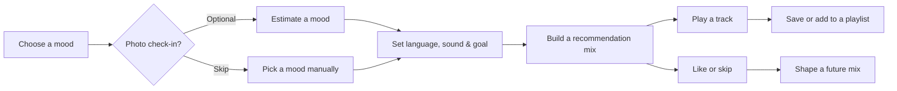
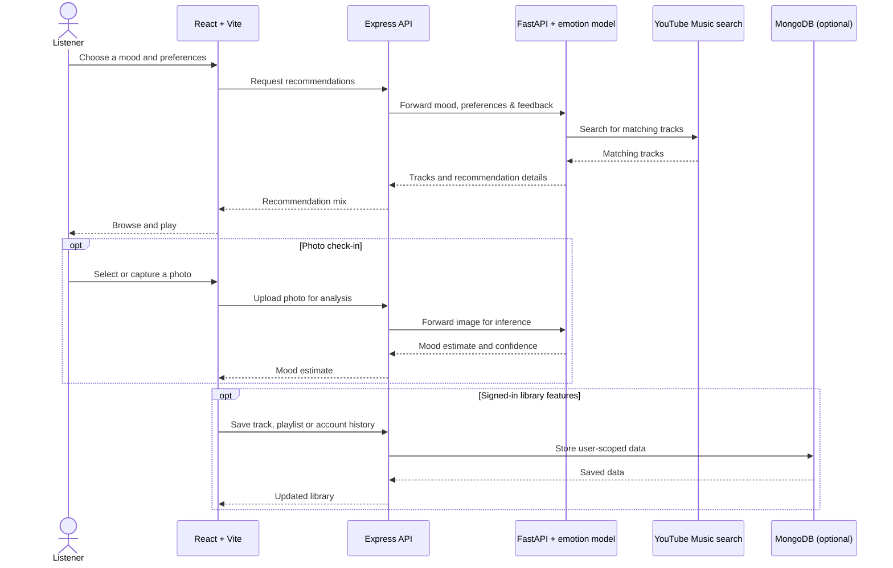
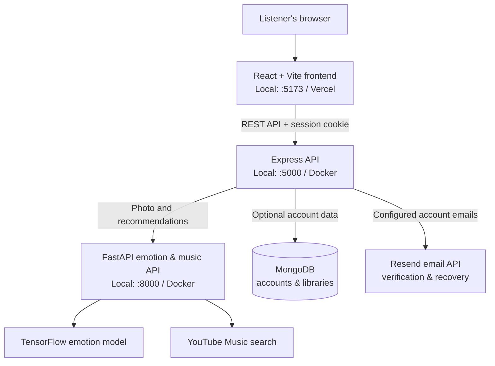

<div align="center">
  
  <h1>Moodwave</h1>
  <p><strong>A soundtrack that starts with how you feel.</strong></p>
  <p>Explore mood-aware music recommendations, shape your mix, and keep the tracks you want to revisit.</p>

  <p>
    
    
    
    
    
    
  </p>
</div>

---

## Table of contents

- [The idea](#the-idea)
- [What you can do](#what-you-can-do)
- [How it works](#how-it-works)
- [Project architecture](#project-architecture)
- [Tech stack](#tech-stack)
- [Run locally](#run-locally)
- [Deploy](#deploy)
- [Configuration](#configuration)
- [Privacy and security](#privacy-and-security)
- [Project structure](#project-structure)
- [Helpful commands](#helpful-commands)

## The idea

Moodwave makes music discovery feel personal without making a photo check-in mandatory. Choose a mood yourself or optionally ask the emotion model for an estimate, tell Moodwave what kind of sound you want, and build a mix to explore.

> **Your feelings are yours to name.** The photo check-in is an estimate for music discovery, not a diagnosis.

## What you can do

| Discover | Personalize | Keep your music |
| --- | --- | --- |
| Choose a mood yourself or request an optional photo-based estimate. | Set a language, sound, and listening goal before asking for recommendations. | Save tracks, create playlists, and keep a listening history. |
| Browse YouTube Music results, with built-in mood picks when live search is unavailable. | Like or skip tracks; recent feedback can influence future mixes. | Use a playback queue with previous/next controls and compact or expanded playback. |

### The listener journey



## How it works



## Project architecture



The frontend and API are separate deployable pieces. In the Vercel setup, `VITE_API_URL` points the browser to the Node API; the Node service forwards emotion and recommendation work to the Python service. MongoDB is needed for accounts and synced libraries, but not for local mood discovery.

### Recommendation flow at a glance

```text
Mood
  + optional language, genre and listening goal
  + recent likes and skips
  ↓
YouTube Music search (or built-in mood picks when unavailable)
  ↓
Ranked mix → playback queue → optional saved library
```

## Tech stack

| Layer | Technology | Responsibility |
| --- | --- | --- |
| Web app | React 18, Vite 6, Lucide | Mood discovery, preferences, recommendations, player, and library UI |
| Application API | Node.js 20+, Express | API routes, signed HTTP-only sessions, account flows, and library endpoints |
| Emotion/music API | Python 3.11, FastAPI, TensorFlow, OpenCV | Image inference and recommendation search |
| Music search | `ytmusicapi` | Finds YouTube Music results; fallback mood picks are available |
| Persistence | MongoDB / MongoDB Atlas | Optional accounts, favorites, playlists, and synced user data |
| Account email | Resend | Verification and password-reset messages when configured |
| Deployment | Vercel and Docker | Static frontend and independently hosted API services |

## Run locally

### Prerequisites

- Python 3.11
- Node.js 20 or newer
- MongoDB, only if you want to use accounts and persistent libraries

From the project root, create a virtual environment and install Python dependencies:

```powershell
python -m venv .venv
.\.venv\Scripts\Activate.ps1
python -m pip install --upgrade pip
python -m pip install -r requirements.txt
```

If PowerShell blocks activation, run `Set-ExecutionPolicy -Scope Process -ExecutionPolicy Bypass` in that terminal and activate again.

Install the JavaScript workspaces:

```powershell
npm.cmd install
```

For account and library features, copy the example server configuration and set your local MongoDB URL and a development session secret:

```powershell
Copy-Item server/.env.example server/.env
```

Then start the frontend and both APIs together:

```powershell
npm.cmd run dev
```

Open **http://localhost:5173**. The local services use:

| Service | Local address |
| --- | --- |
| Moodwave website | `http://localhost:5173` |
| Express API | `http://localhost:5000` |
| FastAPI | `http://127.0.0.1:8000` |
| Node API health | `http://localhost:5000/api/health` |
| Emotion API health | `http://127.0.0.1:8000/health` |

Without MongoDB, discovery and recommendations can still be used, but signed-in features such as saved tracks and playlists are unavailable.

## Deploy

### Option A: Vercel frontend + separate API services

#### 1. Deploy the frontend to Vercel

Import this repository into Vercel and use the **repository root** as the project root. The included [`vercel.json`](./vercel.json) configures the client build and `client/dist` output.

Add this Vercel environment variable for each environment you deploy:

| Variable | Value |
| --- | --- |
| `VITE_API_URL` | HTTPS origin of your Node API, for example `https://api.example.com` (no trailing slash) |

The value is embedded in the frontend at build time, so redeploy after changing it.

#### 2. Deploy the Node API

Build a Docker service from the repository root using [`Dockerfile.server`](./Dockerfile.server), and expose port `5000`. Configure:

| Variable | Purpose |
| --- | --- |
| `NODE_ENV` | Set to `production` |
| `PORT` | Service port; typically `5000` |
| `WEB_ORIGIN` | Exact frontend origin, such as `https://app.example.com`; comma-separate additional allowed origins |
| `PYTHON_API_URL` | Reachable HTTPS origin of the Python emotion API |
| `MONGODB_URI` | Persistent MongoDB connection string |
| `SESSION_SECRET` | Unique random value of at least 32 characters |
| `PUBLIC_APP_URL` | Public frontend URL used in account emails |
| `EMAIL_API_KEY` | Resend API key |
| `EMAIL_FROM` | Sender address verified with Resend |

Do not use `*` for `WEB_ORIGIN`: browser sessions use credentials and require an explicit allowed origin.

#### 3. Deploy the Python emotion API

Build a second Docker service from the repository root using [`Dockerfile.python`](./Dockerfile.python), and expose port `8000` to the Node service. The Python image needs both the source under `python/` and the `emotion_model.h5` file in the project root at build time.

> **Model file note:** `emotion_model.h5` is intentionally excluded by `.gitignore` because it is a generated/large model artifact. Make it available in the Docker build context through your deployment provider's artifact or secret-file mechanism before building the Python image. Without it, photo mood detection cannot start successfully.

#### 4. Connect domains and check the deployment

Use HTTPS custom domains on the **same site** for the frontend and Node API (for example `app.example.com` and `api.example.com`). The signed session cookie is `Secure` and `SameSite=Lax`; unrelated Vercel and API-provider domains may be treated as third-party and cause browsers to block sign-in cookies.

Set the Node service health check to `/api/health`, allow it to reach MongoDB Atlas, and keep the Python API on private networking when available. After deployment:

1. Open `https://api.example.com/api/health`; check that Python and the model are available.
2. Try mood recommendations and a photo check-in.
3. If using accounts, test verification email, sign-in, saved tracks, and playlists.

MongoDB is required for persistent account/library features. Resend credentials and a verified sender are required for production account verification and password recovery.

#### Prepare MongoDB Atlas

1. In Atlas, create a database user with a strong password. This is a **database user**, not your Atlas website login.
2. Add your Node API host's outbound IP address to Atlas **Network Access**. If the host has dynamic egress IPs, follow that provider's recommended private networking or egress-IP setup instead of leaving broad access enabled.
3. In Atlas, choose **Connect → Drivers** and copy the Node.js connection string. Set the database name to `moodwave`, and replace the password placeholder. URL-encode special characters in the database password.
4. Add the full string as the Node API service's `MONGODB_URI` environment variable/secret. Do not put it in Vercel's frontend environment, commit it, or send it in chat.
5. Redeploy or restart the Node API. Its production startup now waits for MongoDB and exits with an error if the URI is missing or the database cannot be reached.
6. Check `/api/health` and confirm its `mongo` field is `true`.

The local `server/.env.example` uses a local MongoDB URI by default. For a local Atlas connection, replace it only in your untracked `server/.env` file. Docker Compose continues to use its own `mongo` service by default.

### Option B: Docker Compose

Install Docker Desktop, copy `.env.example` to `.env`, and set a unique `SESSION_SECRET`. Set `WEB_ORIGIN` to the public site origin and configure the email values if you plan to enable accounts. Ensure the model file is present in the build context, then run:

```powershell
docker compose up --build -d
```

Open **http://localhost:5000**. Compose starts the web/API service, Python service, and MongoDB with persistent storage. For public access, put HTTPS/TLS in front of the app. Stop services without deleting database storage with:

```powershell
docker compose down
```

## Configuration

| File | What it configures |
| --- | --- |
| [`.env.example`](./.env.example) | Docker Compose and combined-app production settings |
| [`server/.env.example`](./server/.env.example) | Local Express settings and allowed development origins |
| [`client/.env.example`](./client/.env.example) | Optional Vite API-origin setting |
| [`vercel.json`](./vercel.json) | Vercel client build and static output |
| [`requirements.txt`](./requirements.txt) | Full local Python dependencies, including the Streamlit app |
| [`requirements-api.txt`](./requirements-api.txt) | Lean dependencies for the FastAPI container |

Never commit real `.env` files, `browser.json`, Resend keys, database credentials, or production session secrets.

## Privacy and security

- Photo check-in is optional. Photos are sent to the emotion API for inference and are not stored by the app.
- A mood prediction is a music-discovery estimate, not medical advice or a diagnosis.
- Account sessions use signed HTTP-only cookies; passwords are stored as scrypt hashes.
- Saved data is scoped to the signed-in account. MongoDB is not required for mood discovery.
- Keep production services on HTTPS, use a strong unique session secret, and restrict API origins.

## Project structure

```text
moodwave/
├── client/
│   ├── public/assets/       # Logos and public image assets
│   └── src/
│       ├── components/      # Reusable interface components
│       └── lib/             # API and local-storage helpers
├── server/
│   └── src/index.js         # Express API, accounts, and MongoDB models
├── python/
│   ├── emotion_api.py       # FastAPI inference and recommendation service
│   ├── musicrec.py          # Original Streamlit interface
│   ├── train_model.py       # Model training script
│   ├── setup_ytmusic.py     # Optional local YouTube Music setup
│   └── test_music.py        # YouTube Music smoke test
├── emotion_model.h5         # Local model artifact; provide to the Python image build
├── Dockerfile               # Combined app image for Docker Compose
├── Dockerfile.server        # Standalone Express API image
├── Dockerfile.python        # Standalone FastAPI image
├── docker-compose.yml       # Local/combined production stack
├── requirements.txt         # Full local Python environment
├── requirements-api.txt     # Python API container dependencies
└── vercel.json              # Vercel frontend configuration
```

## Helpful commands

| Task | Command |
| --- | --- |
| Install JavaScript dependencies | `npm.cmd install` |
| Start local web and API services | `npm.cmd run dev` |
| Build the frontend | `npm.cmd run build` |
| Start the original Streamlit app | `python -m streamlit run python/musicrec.py` |
| Train the emotion model | `python python/train_model.py` |
| Configure local YouTube Music search | `python python/setup_ytmusic.py` |
| Start Docker Compose | `docker compose up --build -d` |

---

<div align="center">
  <sub>Made for the mood you're in — and the one you're heading toward.</sub>
</div>
